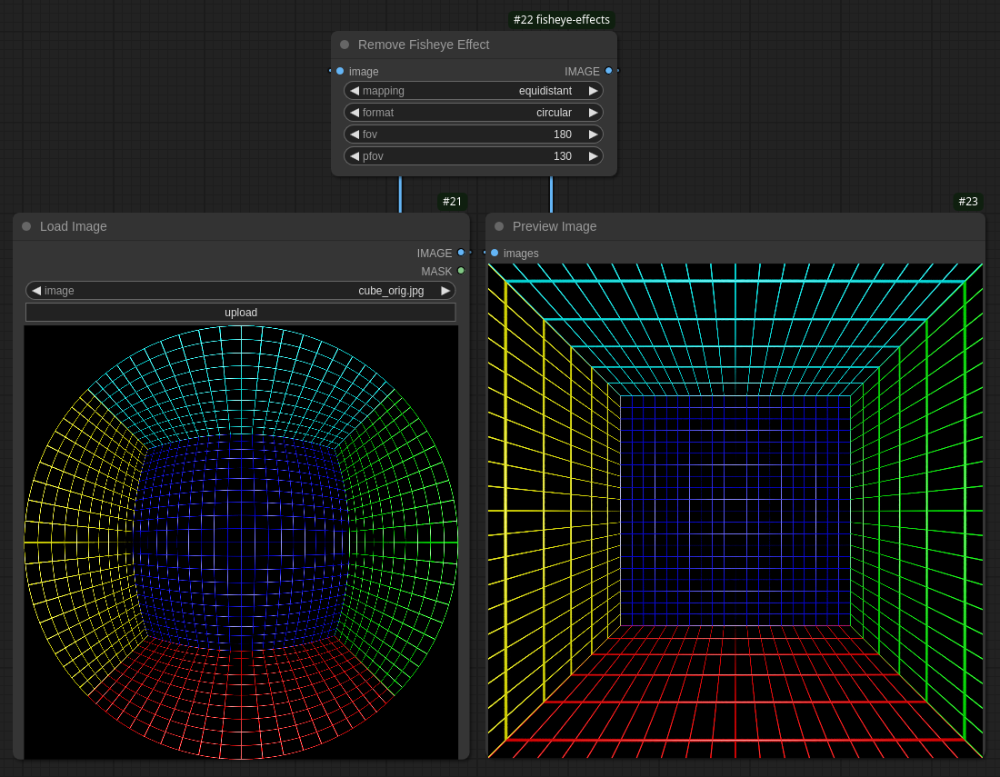

# ComfyUI Fisheye Effects Nodes

Provides tools for applying and removing fisheye lens effects from images.



## Features

- FisheyeNode: Apply fisheye distortion to images
- DefisheyeNode: Remove fisheye distortion from images
- Multiple distortion mappings: equidistant, equisolid, orthographic, stereographic
- Format options: fullframe and circular
- Adjustable FOV and PFOV parameters

### Tips
- The `orthographic` mapping keeps the entirety of the image data, so going back and forth works well, see `examples/BackAndForth.json`

## Installation

### Using ComfyUI Manager
You can simply find and install this node from the "Custom Nodes Manager" inside the ComfyUI Manager menu

### Manually
1. Clone this repository into your ComfyUI custom_nodes folder:
   ```bash
   cd ComfyUI/custom_nodes
   git clone https://github.com/Kidev/ComfyUI-Fisheye-effects
   ```

2. Install the required dependencies:
   ```bash
   cd ComfyUI-Fisheye-effects
   python install.py
   # Or using venv of ComfyUI
   source [venv]/bin/activate
   pip install -r requirements.txt
   ```

3. Restart ComfyUI

## Usage

The nodes will appear in the node menu under the "image/processing" category:
- "Apply Fisheye Effect"
- "Remove Fisheye Effect"

### Parameters

- image: Input image
- mapping: Distortion mapping mode (equidistant, equisolid, orthographic, stereographic)
- format: Output format (fullframe, circular)
- fov: Field of view in degrees (0-360)
- pfov: Perspective field of view in degrees (0-360)

## Example Workflows

Check the examples folder for sample workflows demonstrating various use cases.
